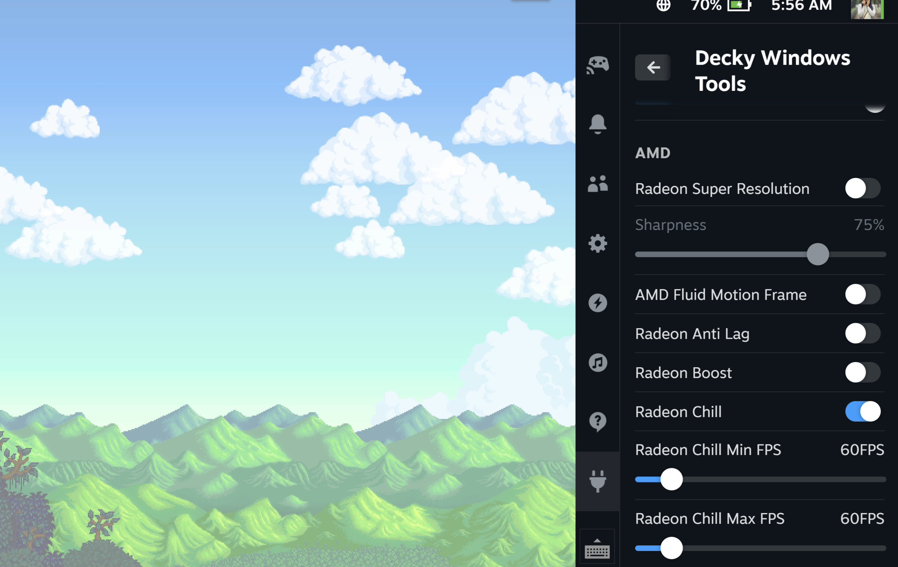

# Decky Windows Tools

This is a decky plugin specifically implemented for Windows. The main goal is to integrate everything into Steam, to mimic SteamOS functionalities.

Current basic functions:
 - Adjust Volume, Brightness, Refresh Rate, Multi-Monitor Modes.
 - Adjust RTSS OSD.
 - Limit TDP.
 - AMD settings.
 - Lossless Scaling profiles.